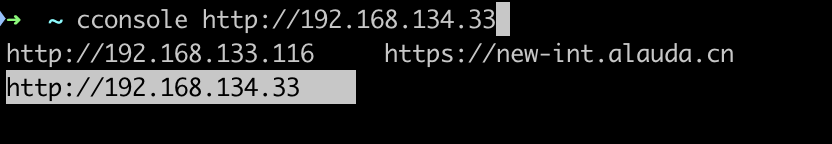

### 本工具旨在快速切换前端开发环境信息

通过自动补全，可以让你无需退出当前工作环境，直接切换开发环境



## 安装切换环境 cli

```sh
yarn global add @zangguodong/change-console-env
```

## 添加自动补全脚本

```sh
wget -P ~/custom_fpath https://raw.githubusercontent.com/zangguodong/change-console-env/master/_cconsole
```

请在 shell 启动脚本，如 .zshrc 末尾加上

```sh
fpath=(~/custom_fpath $fpath)
autoload -U compinit && compinit
```

## 创建环境信息密码文件

请在用户目录下创建环境信息文件， `~/.console_passwd.yaml` 格式为

```yaml
- api_address: http://a.b.c.d
  username: a
  password: b
- api_address: http://a.b.c.e
  username: c
  password: d
```

## 异常排查

如自动补全功能不生效，请尝试

```sh
rm ~/.zcompdump
exec zsh -l
```
